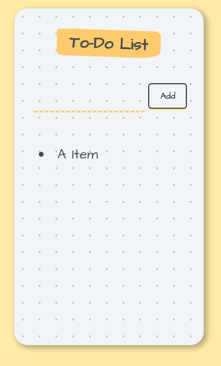
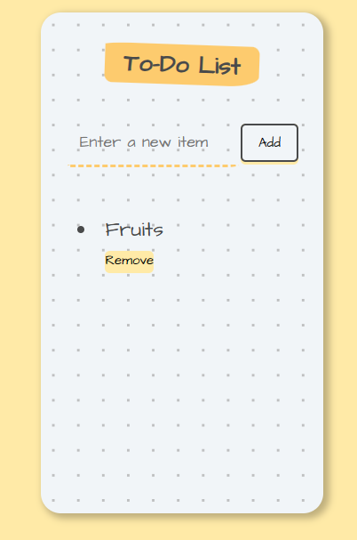

# React Todo List

A beginner-friendly React.js Todo list project designed for learning purposes. This simple application allows users to add and remove tasks, making it an ideal starting point for those exploring React state management and basic UI interactions.


## Features:

- **Add Items:** Easily add new tasks to your Todo list.
- **Remove Items:** Mark tasks as completed and remove them with a single click.
- **User-Friendly Interface:** Simple and intuitive design for easy navigation.
- **Learning Focus:** Created to help beginners understand React state management concepts.

## Getting Started:

1. Clone the repository:

   ```bash
   git clone https://github.com/yourusername/react-todo-list.git
   cd react-todo-list
   ```

2. Required Dependencies:

```
   react
   react-dom
```
## Screenshots:

<div align="center">
  
  
</div>


